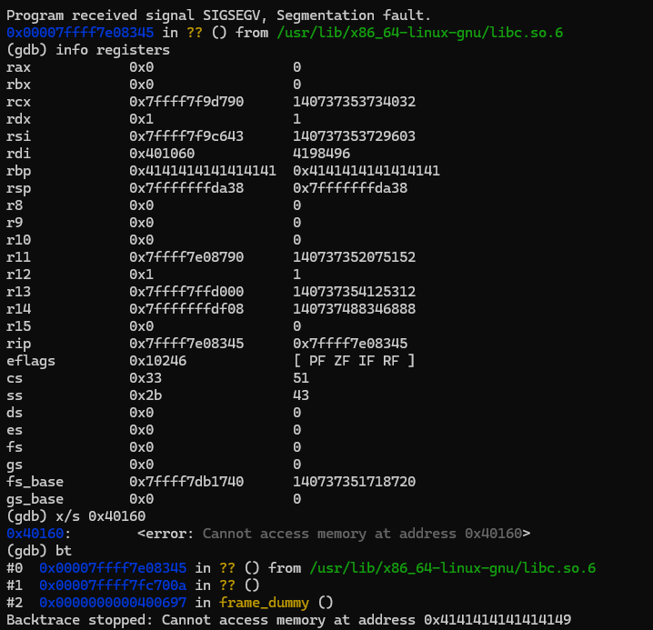
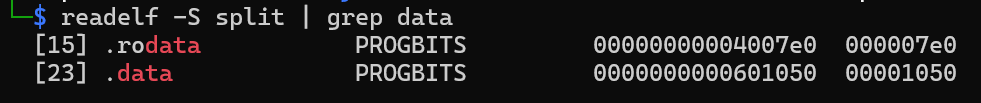
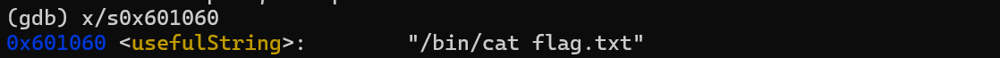

# Reconstructing Function Calls: Why My Exploit Failed in "split"

After understanding ret2win, I started solving the split challenge (x86_64) from ROP Emporium.
[ROP Emporium - split challenge](https://ropemporium.com/challenge/split.html)

This write-up focuses on the mistakes I made during the challenge and what they revealed about how function calls actually work in exploitation.

## 1. From ret2win to a Real Problem

In modern systems, defenses like NX (Non-Executable memory) prevent arbitrary code execution on the stack.

Because of this, exploitation is no longer as simple as in ret2win, where we only redirect execution to an existing function.

The split challenge introduces a more realistic scenario where we must reuse existing code by correctly setting up a function call.

## 2. When system() Is Called but Nothing Happens

At first, I encountered a segmentation fault inside libc. Since no output was produced, I assumed the exploit had failed.

However, by inspecting the execution state, I realized that control had already reached system().

- RIP was inside libc
- RDI contained a value (the argument)

This means the function call itself had succeeded.

The real issue was that the argument passed to system() was invalid:

　**x/s 0x401060 → cannot access memory**

So the call was effectively:

　**system(invalid_pointer)**

This made me realize that exploitation can fail at multiple stages:

- Failing before reaching the function
- Reaching the function but passing incorrect arguments
- Successfully calling the function but losing control afterward

## 3. The Missing Piece: How Function Calls Actually Work

At this point, I realized that simply controlling the instruction pointer (RIP) is not enough.

On x86_64 systems, function arguments are passed through registers. The first argument is passed in the RDI register.

A normal function call like:

　**system("/bin/cat flag.txt")**

is internally executed as:

　**rdi = pointer to "/bin/cat flag.txt"**

　**call system**

In the split challenge, the function and its argument are separated. So we must reconstruct the call manually using a ROP chain:

　**pop rdi**　→ set the argument

　**call system**

This made it clear that exploitation is not just about redirecting execution, but also about correctly preparing the program state.

## 4. The Real Bug: Address Misunderstanding

Initially, I found the string as below:

I assumed this meant the address was:

　**0x400000 + 0x1060 = 0x401060**

However, this was incorrect. The value 0x1060 is a file offset, not a runtime memory address.

To understand where this offset actually belongs, I inspected the ELF sections:

This showed that the .data section starts at file offset 0x1050 and is mapped to memory at 0x601050.

Since 0x1060 falls within the range of the .data section:

　**0x1050 ≤ 0x1060 < 0x1072**

the string must reside in .data.

To calculate the correct runtime address:

　**offset within section = 0x1060 - 0x1050 = 0x10**

　**actual address = 0x601050 + 0x10 = 0x601060**

This was confirmed in GDB:

## 5. What "split" Really Taught Me

The key takeaway from this challenge is that not all failures are the same, even if they look identical at first.

A segmentation fault may appear as a single type of failure, but it can happen at different stages:

 - Failing before reaching the target function
 - Reaching the function but passing incorrect arguments
 - Successfully calling the function but losing control afterward

Understanding where the failure occurs is more important than simply noticing that the program crashed.

Another important lesson is that runtime memory addresses are not the same as file offsets.

I initially assumed that adding a base address to an offset would give the correct result. However, this only works when the data resides in the expected section.

In reality, each section (such as .text or .data) is mapped to a different memory region, and the correct address must be calculated based on that mapping.

## 6. From split to ASLR

This challenge showed how code execution is still possible under NX by reusing existing functions.

However, this approach assumes that we already know the correct memory addresses.

In real systems, this assumption does not always hold.

Modern protections such as ASLR randomize memory layouts, making it much harder to rely on fixed addresses.

In the next step, I will explore how address randomization affects exploitation.

